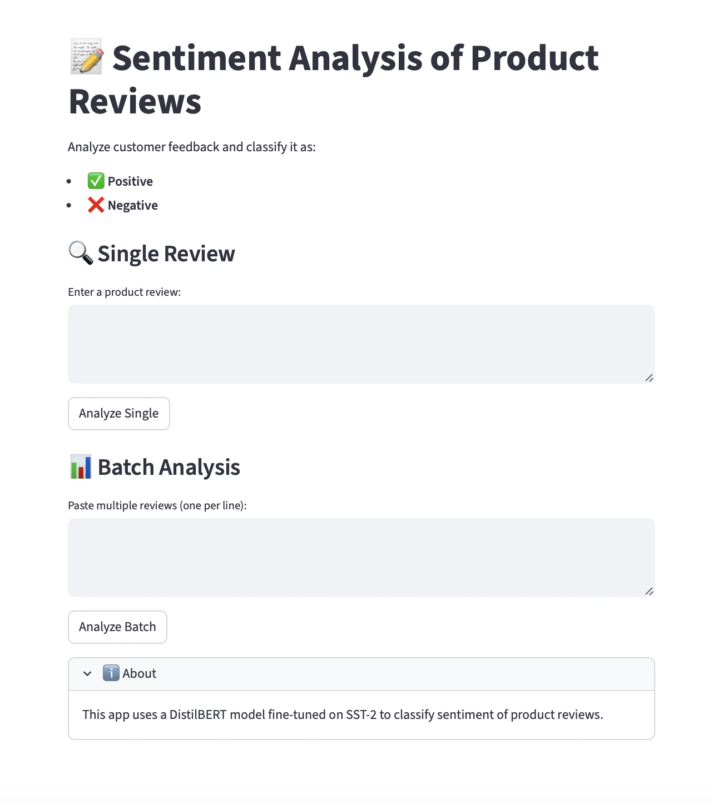

# 📝 Sentiment Analysis of Product Reviews

This project implements a **sentiment analysis web app** using **DistilBERT** (a lighter version of BERT) fine-tuned on the SST-2 dataset.  
It classifies product reviews into two categories:  
- ✅ Positive  
- ❌ Negative  

Built with **Python, Hugging Face Transformers, and Streamlit**.

---



---

## 🚀 Features
- Analyze a **single review**.
- Batch analysis of **multiple reviews at once**.
- Shows individual predictions and a **summary** (Positive vs Negative).
- Lightweight, production-ready design.

---

## 🛠️ Tech Stack
- Python 3.11+
- [Transformers](https://huggingface.co/transformers/)
- PyTorch
- Streamlit

---

## 📦 Installation

1. Clone the repository:
   ```bash
   git clone https://github.com/<your-username>/sentiment-analysis.git
   cd sentiment-analysis
